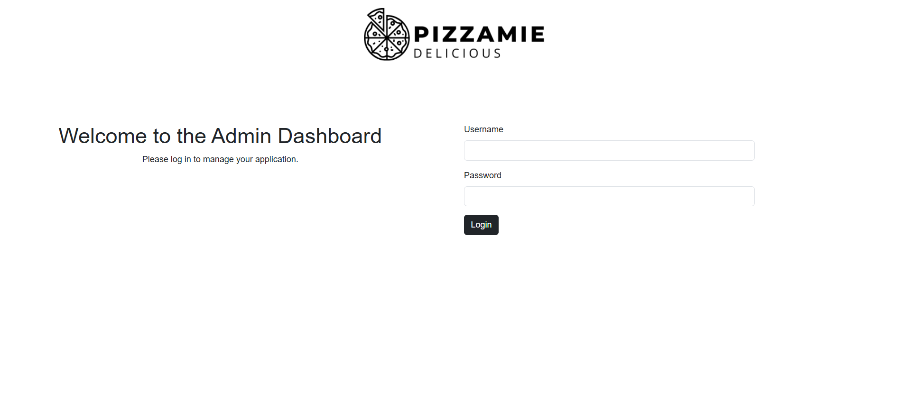
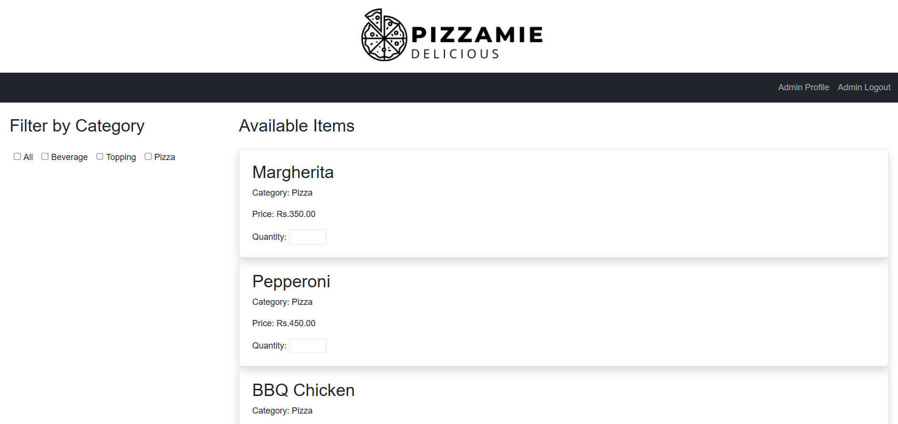
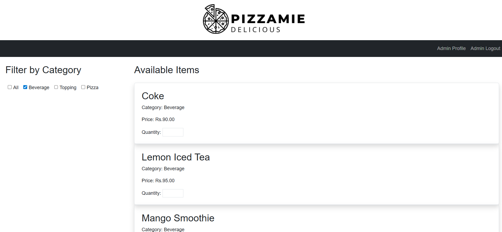
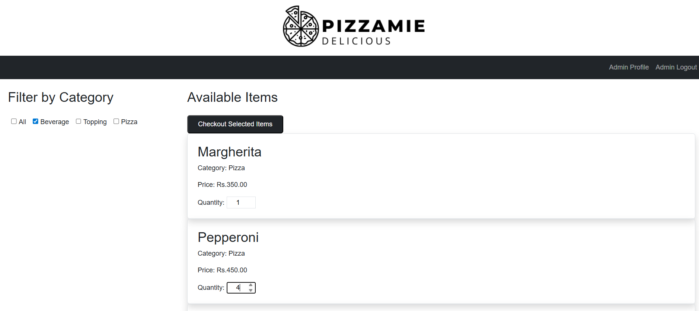
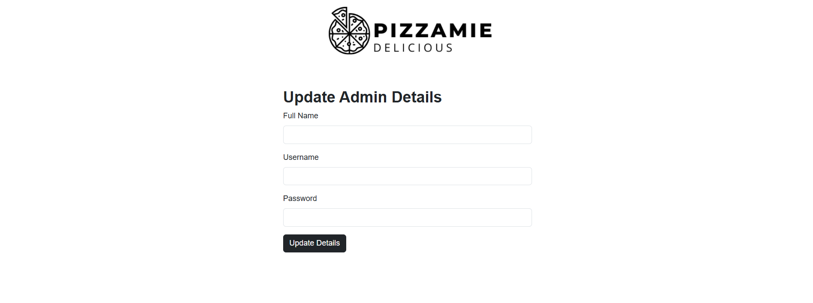
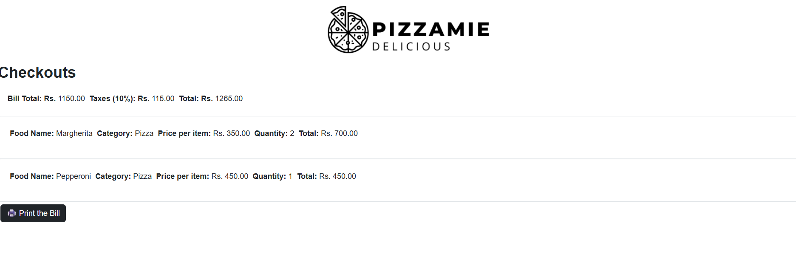
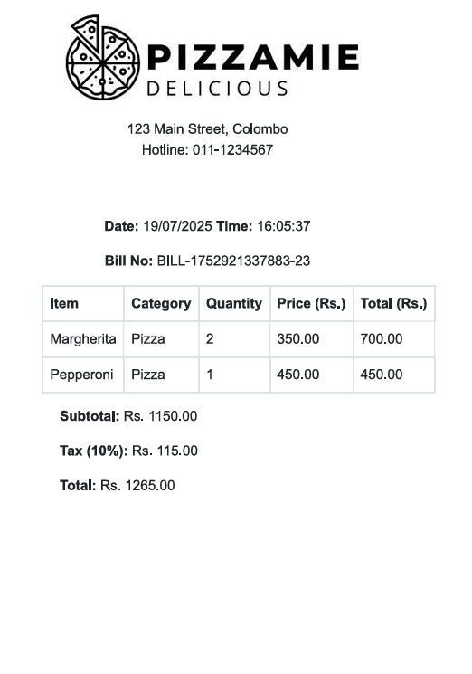

# 🍕 Pizza-Shop-Billing-Web-Application

A full stack Pizza Shop Billing Web Application built with **Gin (Golang)**, **React.js**, and **MySQL**.

---

## 🧾 Features

- Admin login system (default credentials)
- Select items with quantity from 3 categories:
  - Pizzas
  - Toppings
  - Beverages
- Checkout with item breakdown and tax (10%)
- Bill generation and printing
- Admin profile update (username, full name, password)
- Protected routes (no access without login)
- Unique username in MySQL

---

## 🛠️ Tech Stack

- **Frontend**: React.js + Bootstrap
- **Backend**: Gin (Golang)
- **Database**: MySQL

---

## 🚀 Getting Started

### 🔧 1. Clone the Repository

git clone https://github.com/kavindacena99/Pizza-Shop-Billing-Web-Application.git
cd Pizza-Shop-Billing-Web-Application

### 💾 2. Setup MySQL Database
Create a database named pizza_shop

Import tables using your schema

Example table structure for items:

CREATE TABLE items (
  id BIGINT UNSIGNED AUTO_INCREMENT PRIMARY KEY,
  name LONGTEXT,
  category LONGTEXT,
  price DOUBLE
);
Ensure admin table is created and has default values:
INSERT INTO admins (username, password, fullname) VALUES ('admin', 'admin123', 'Administrator');
### 🧱 3. Run Backend
cd Backend
go mod tidy
go run main.go
Make sure your MySQL connection details are correctly set in the backend code (e.g., database/database.go).

### 🎨 4. Run Frontend
cd Frontend
npm install
npm run dev
Frontend runs at: http://localhost:5173

Backend API runs at: http://localhost:8080

## 🖥️ Login Page

## 🧾 Item List Page

## ✅ Admin Details Update

## ✅ Checkout Page

## 🖨️ Printed Bill 

### 🎨 4. Run Frontend

🔒 Admin Info
Default Username: admin

Default Password: admin123

Admin can update credentials after logging in.

📌 Notes
Ensure MySQL is running before backend.

Bill number is generated randomly.

PDF filename uses current date.

Total includes 10% tax.

Uses React Router to protect routes from unauthorized access.

✍️ Author
Developed by Kavinda Supun Dissanayake

🧾 License
This project is for educational purposes only. Contact me for permission if you want to use it commercially.
